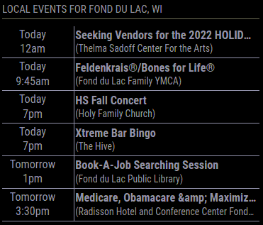

# MMM-LocalEvents
## This module for MagicMirror² displays upcoming (local) events for the specified location.  Allows you to specify how many days in the future to get events for.  Written following the structure of the MagicMirror weather module where additional event providers can be written.  Currently supports Google as a provider.



## Requires:
- MagicMirror
- Axios module (installed with MagicMirror)

## Manual install
Go To ```MagicMirror/modules``` folder and then:
```
git clone https://github.com/dWoolridge/MMM-LocalEvents.git
cd MMM-LocalEvents
npm install
```
## Configuration:  
- Required Configuration Parameters:

```
    {
      module:          "MMM-LocalEvents",
      position:        "top_left",
      config: {
                eventProvider:  "google",
                providerURL:    "https://www.google.com/search?q=events+[LOCATION]&events&rciv=evn",
                location:       "fond du lac, wi",
              }
    },
```
- All Configuration Parameters:
```
    {
      module:          "MMM-LocalEvents",
      position:        "top_left",
      header:          "Local Events",
      appendLocationNameToHeader: true,  // Show the location text with the header
      hiddenOnStartup:  false,
      disabled:         false,
      config: {
                eventProvider:  "google",
                providerURL:    "https://www.google.com/search?q=events+[LOCATION]&events&rciv=evn",
                location:       "fond du lac, wi",
                reloadInterval:  10 * 60 * 1000,     // time to reload event data (in ms -- 10 minutes)
                updateInterval:  10 * 1000,          // time to cycle through pages (in ms -- 10 seconds)
                maxRows:         6,                  // Number of rows to display on the screen
                maxEvents:       -1,                 // Max number of Events to store (-1 is unlimited)
                cycleEventPages: true,               // If number of events > maxRows, then cycle through pages of events
                animationSpeed:  2 * 1000,           // Set to 0 for no animation (fade-out / fade-in)

                timeFormat:       config.timeFormat,
                lang:             config.language,

                ignoreToday:      false,             // Don't list any events ocurring today

                fade:             false,             // Fade out the last several rows
                fadePoint:        0.75,              // Start on 3/4th of the list.
                initialLoadDelay: 0,                 // 0 seconds delay
                appendLocationNameToHeader: true,    // Add the location: variable to the header
                tableClass:       "small",
                showPeriod:       true,              // Add am/pm to time format
                showPeriodUpper:  false,             // Show as AM / PM rather than am / pm
            }
    },
```
## Collaborate
Pull requests are welcome.

## TO DO
- Replace \x27, \x26, \u2019, &amp with characters in event text
- Consider adding functionality for a type:  daily/nextweek/nextmonth/etc. 
